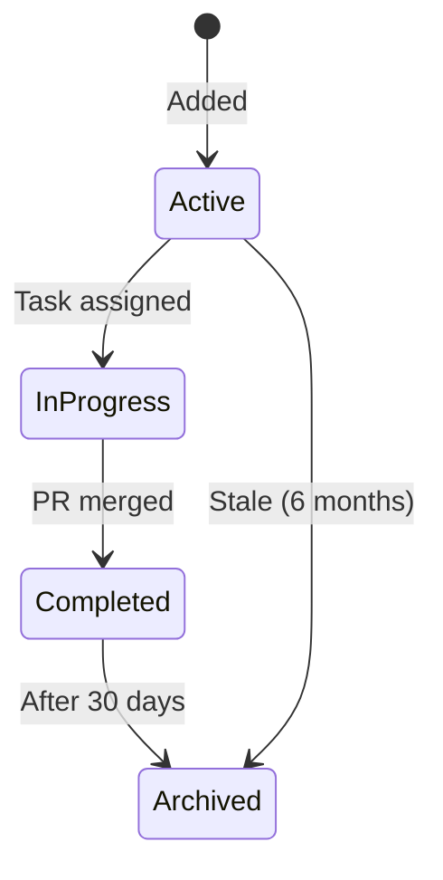

# E06-T012 Specification: Recommendations & Improvements Tracking System

**Epic:** E06 - Knowledge Base & Documentation Infrastructure
**Task ID:** E06-T012
**Priority:** Medium
**Depends On:** E06-T005, E06-T006, E06-T007 (content exists to improve)
**Blocks:** None (enhancement for future workflow)
**Policy Document:** [E06-T012-policy.md](./E06-T012-policy.md)

---

## Problem Statement

After epic reviews and code/QA/architecture reviews, valuable recommendations and improvements are scattered across review documents without a systematic way to track, prioritize, or action them:

**Current Issues:**

1. **Lost Context**: Recommendations buried in epic review reports
2. **No Prioritization**: No clear critical vs. nice-to-have distinction
3. **No Tracking**: Can't see what's been addressed vs. pending
4. **No Visibility**: Hard to know total technical debt across domains
5. **Forgotten Items**: Medium/low priority items never surface during planning

**Example from E02 Epic Review:**

```markdown
### Medium Priority (Nice to Have)

3. **Make connection pool configurable** (from E01-T003 code review)
   - Severity: Medium
   - Type: Enhancement
   - Description: Pool settings are hardcoded
   - Recommendation: Consider for next epic
   - Estimated Effort: Small (2h)
```

**Where does this go after the epic review?** Currently: nowhere systematic.

---

## Proposed Solution

Create a dedicated `/improvements/` section in the KB with:

1. **Domain-specific pages** tracking recommendations per area
2. **Cross-domain index** for overview and critical items
3. **Standardized table format** for consistent categorization
4. **Integration with epic reviews** for systematic capture
5. **Lifecycle management** to prevent staleness

**Visual Structure:**

```
apps/docs/src/improvements/
├── index.md              # Overview + critical items + stats
├── auth.md               # Authentication & authorization improvements
├── database.md           # Database & ORM improvements
├── api.md                # API design improvements
├── ai.md                 # AI gateway improvements
├── testing.md            # Testing improvements
└── infrastructure.md     # Deployment, CI/CD, monitoring
```

---

## Policy Foundation

This implementation follows the detailed policy document at:
**[E06-T012-policy.md](./E06-T012-policy.md)**

Key policy decisions:

- **ID Format**: `{DOMAIN}-{NNN}` (e.g., `AUTH-042`, `DB-015`)
- **Priority Levels**: Critical, High, Medium, Low
- **Blocking Status**: Yes (blocks deployment) or No
- **Lifecycle**: Active → In Progress → Completed → Archived
- **Integration**: Auto-populated from epic reviews

See policy document for full decision framework, categorization criteria, and examples.

---

## Implementation Scope

### Initial Implementation (E06-T012)

**Included:**
- Create folder structure and initial pages
- Define standardized table format
- Document usage guidelines in Contributing section
- Populate with examples from E01-E05 epic reviews
- Update VitePress navigation configuration
- Integration instructions for epic review process

**Deferred (Future Enhancements):**
- Automation scripts (validate IDs, generate index stats)
- CI enforcement (fail on stale Critical items)
- Auto-population from epic reviews (manual for now)
- GitHub Issues integration for Critical items

---

## File Structure & Templates

### Directory Structure

```
apps/docs/src/improvements/
├── index.md              # Overview page
├── auth.md               # Authentication domain
├── database.md           # Database domain
├── api.md                # API design domain
├── ai.md                 # AI gateway domain
├── testing.md            # Testing domain
└── infrastructure.md     # DevOps domain
```

### Index Page Template

**File:** `apps/docs/src/improvements/index.md`

```markdown
---
title: Improvements & Recommendations
description: Technical debt, enhancements, and optimization opportunities across all domains
---

# Improvements & Recommendations

Systematic tracking of technical improvements identified through epic reviews,
code reviews, and ongoing development. This section helps prioritize technical
debt and enhancement opportunities.

## Summary Statistics

- **Critical (Blocking)**: 0 items
- **High Priority**: 3 items
- **Medium Priority**: 8 items
- **Low Priority**: 5 items
- **Total Active**: 16 items
- **Completed (Last 30 Days)**: 4 items

::: warning Critical Items Require Attention
Critical items block production deployment. See [Critical Items](#critical-items-cross-domain) below.
:::

## How to Use This Section

**For Developers:**
- Check your domain's improvement page before starting new work
- Reference improvement IDs in commit messages when addressing items
- Add new recommendations as you discover technical debt

**For Project Managers:**
- Review Critical/High items during sprint planning
- Select 1-2 medium priority items per sprint
- Track completion rate over time

**For Code Reviewers:**
- Add non-blocking improvements to domain pages during reviews
- Reference improvement IDs in review comments
- Update priority if issue severity changes

## Critical Items (Cross-Domain)

Items that block production deployment or present security risks.

::: tip No Critical Items
There are currently no critical blocking items. 🎉
:::

<!-- When critical items exist:
| ID | Domain | Issue | Description | Tracking | Added |
|----|--------|-------|-------------|----------|-------|
| AUTH-001 | Auth | Security | OAuth callback missing CSRF validation | E02-T015 | 2026-01-10 |
-->

## By Domain

### Authentication & Authorization

**Active:** 2 High, 3 Medium, 1 Low

Recent focus: Session caching, rate limiting improvements.

[View Auth Improvements →](/improvements/auth)

### Database & ORM

**Active:** 1 High, 2 Medium

Recent focus: Query optimization, connection pooling.

[View Database Improvements →](/improvements/database)

### API Design & Patterns

**Active:** 3 Medium, 2 Low

Recent focus: Error handling consistency, validation patterns.

[View API Improvements →](/improvements/api)

### AI Gateway Integration

**Active:** 1 High, 1 Medium

Recent focus: Streaming performance, error recovery.

[View AI Improvements →](/improvements/ai)

### Testing

**Active:** 1 High, 2 Medium, 1 Low

Recent focus: Test coverage, factory patterns.

[View Testing Improvements →](/improvements/testing)

### Infrastructure

**Active:** 1 Medium, 1 Low

Recent focus: CI optimization, monitoring setup.

[View Infrastructure Improvements →](/improvements/infrastructure)

## Recently Completed

Last 10 improvements addressed across all domains:

| ID | Domain | Issue | Description | Completed | Task |
|----|--------|-------|-------------|-----------|------|
| AUTH-000 | Auth | Security | Add CSRF protection to forms | 2026-01-12 | E02-T012 |
| DB-001 | Database | Performance | Add indexes for common queries | 2026-01-10 | E01-T015 |
| TEST-003 | Testing | Coverage | Add integration tests for auth flow | 2026-01-08 | E02-T008 |

## Contributing

To add a new recommendation:

1. Choose the appropriate domain page
2. Assign next available ID (`{DOMAIN}-{NNN}`)
3. Categorize priority (Critical/High/Medium/Low)
4. Determine blocking status (Yes/No)
5. Estimate effort (Small/Medium/Large)
6. Link to source (epic review, code review, etc.)
7. Update statistics in this index

See [Improvements Policy](/contributing/improvements-policy) for detailed guidelines.

## References

[1]: /backlog/docs/specs/E06/E06-T012-policy.md "E06-T012 Improvements Tracking Policy"
[2]: /backlog/tasks/E06/_epic.md "E06: Knowledge Base Infrastructure"
```

### Domain Page Template

**File:** `apps/docs/src/improvements/auth.md` (example)

```markdown
---
title: Authentication & Authorization Improvements
description: Technical debt, enhancements, and optimizations for the auth domain
---

# Authentication & Authorization Improvements

Recommendations for improving authentication, authorization, session management,
and permission systems. Items sourced from epic reviews, security audits, and
ongoing development.

## Domain Overview

**Current State:**
- Lucia-based session management
- CASL for permissions
- OAuth providers (Google, Microsoft)
- Rate limiting middleware

**Recent Changes:**
- E02 completed: Core auth infrastructure
- All critical security issues addressed
- Performance monitoring in place

## Active Recommendations

### Critical (Blocking)

::: tip No Critical Items
No blocking items currently. 🎉
:::

<!-- Example when critical items exist:
| ID | Issue | Description | Impact | Effort | Tracking | Added |
|----|-------|-------------|--------|--------|----------|-------|
| AUTH-001 | Security | OAuth callback missing CSRF validation | High | Medium | E02-T015 | 2026-01-10 |

**AUTH-001 Details:**
- **Source**: E02-T004 security review
- **Description**: OAuth callback endpoints vulnerable to CSRF attacks
- **Impact**: User accounts could be compromised via CSRF
- **Mitigation**: Add state parameter validation to OAuth flow
- **Blocking**: Yes - security vulnerability
-->

### High Priority

| ID | Issue | Description | Impact | Effort | Tracking | Added |
|----|-------|-------------|--------|--------|----------|-------|
| AUTH-002 | Performance | Session validation queries not cached | Medium | High | E07-T003 | 2026-01-12 |
| AUTH-003 | Monitoring | Add session hijacking detection | Medium | Medium | Backlog | 2026-01-13 |

**AUTH-002 Details:**
- **Source**: Production telemetry analysis
- **Description**: Every request hits database for session validation (+150ms avg)
- **Impact**: Increased latency, database load
- **Mitigation**: Implement Redis caching for active sessions
- **Blocking**: No - performance optimization

**AUTH-003 Details:**
- **Source**: E02 security review suggestions
- **Description**: No detection for suspicious session usage patterns
- **Impact**: Delayed response to account compromise
- **Mitigation**: Log IP changes, concurrent sessions, unusual activity
- **Blocking**: No - security hardening

### Medium Priority

| ID | Issue | Description | Impact | Effort | Tracking | Added |
|----|-------|-------------|--------|--------|----------|-------|
| AUTH-004 | DX | Add debug logging for auth failures | Low | Small | Backlog | 2026-01-13 |
| AUTH-005 | Enhancement | Support refresh token rotation | Low | High | Future | 2026-01-14 |
| AUTH-006 | Testing | Add E2E tests for OAuth flows | Low | Medium | Backlog | 2026-01-14 |

### Low Priority

| ID | Issue | Description | Impact | Effort | Tracking | Added |
|----|-------|-------------|--------|--------|----------|-------|
| AUTH-007 | Documentation | Document session extension strategy | Low | Small | Backlog | 2026-01-14 |
| AUTH-008 | Enhancement | Add "Remember Me" functionality | Low | Medium | Future | 2026-01-14 |

## Completed Improvements

Resolved recommendations with implementation details.

| ID | Issue | Description | Completed | Task | Notes |
|----|-------|-------------|-----------|------|-------|
| AUTH-000 | Security | Add CSRF protection to login forms | 2026-01-12 | E02-T012 | Uses double-submit cookie pattern |
| AUTH-001-OLD | Testing | Add integration tests for auth flow | 2026-01-08 | E02-T008 | 15 new tests added |

## References

[1]: /backlog/docs/reviews/E02/_epic-review.md "E02 Epic Review"
[2]: /backlog/completed/E02/E02-T002.md "E02-T002: OAuth Providers"
[3]: /backlog/completed/E02/E02-T008.md "E02-T008: Auth Integration Tests"

## Related Documentation

- [Session Lifecycle](/auth/concepts/sessions)
- [OAuth Providers](/auth/concepts/oauth)
- [Authentication Guards](/auth/patterns/guards)
```

---

## ID Assignment System

### Format

`{DOMAIN}-{NUMBER}`

**Examples:**
- `AUTH-042` - Authentication domain, 42nd item
- `DB-015` - Database domain, 15th item
- `API-008` - API domain, 8th item

### Domain Prefixes

| Domain | Prefix | Example |
|--------|--------|---------|
| Authentication & Authorization | `AUTH` | `AUTH-042` |
| Database & ORM | `DB` | `DB-015` |
| API Design & Patterns | `API` | `API-008` |
| AI Gateway Integration | `AI` | `AI-003` |
| Testing | `TEST` | `TEST-012` |
| Infrastructure (CI/CD, Deploy) | `INFRA` | `INFRA-005` |

### Numbering Rules

1. **Sequential**: Assign next available number per domain
2. **Zero-Padded**: Use 3 digits (`001` not `1`) for consistency
3. **No Reuse**: Don't reuse IDs even after items are completed
4. **No Gaps**: Assign consecutively (don't skip numbers)

### ID Assignment Process

**Manual (Initial Implementation):**

1. Open the domain improvement page
2. Find highest existing ID number
3. Increment by 1
4. Format as `{DOMAIN}-{NNN}`
5. Add to appropriate priority table

**Example:**
```markdown
<!-- Existing highest ID: AUTH-007 -->

<!-- Add new item: -->
| AUTH-008 | Enhancement | Add "Remember Me" functionality | ...
```

**Future (Automation):**
- Script reads all improvement pages
- Generates next ID per domain
- Validates no duplicates exist

---

## Table Format Specification

### Active Recommendations Table

```markdown
| ID | Issue | Description | Impact | Effort | Tracking | Added |
|----|-------|-------------|--------|--------|----------|-------|
| {DOMAIN-NNN} | {Type} | {Brief description} | {High/Medium/Low} | {Small/Medium/Large} | {Task ID or "Backlog"} | {YYYY-MM-DD} |
```

**Column Definitions:**

- **ID**: Unique identifier (`{DOMAIN}-{NNN}`)
- **Issue**: Type of improvement (Security, Performance, DX, Testing, etc.)
- **Description**: 1-sentence summary (50 chars max for readability)
- **Impact**: Business/user impact (High/Medium/Low)
- **Effort**: Estimated implementation effort
  - Small: <4 hours
  - Medium: 4-16 hours
  - Large: >16 hours
- **Tracking**: Task ID if work scheduled, "Backlog" if not, "Future" if deferred
- **Added**: Date recommendation was added (ISO format: YYYY-MM-DD)

### Completed Improvements Table

```markdown
| ID | Issue | Description | Completed | Task | Notes |
|----|-------|-------------|-----------|------|-------|
| {DOMAIN-NNN} | {Type} | {Brief description} | {YYYY-MM-DD} | {Task ID} | {Optional context} |
```

**Column Definitions:**

- **ID**: Original recommendation ID
- **Issue**: Type (same as active)
- **Description**: Brief summary (same as active)
- **Completed**: Date implementation merged (ISO format)
- **Task**: Task ID that implemented the improvement
- **Notes**: Optional brief context about implementation

---

## Priority Categories & Criteria

### Critical (Blocking)

**Definition:** Blocks production deployment or presents immediate security risk

**Criteria:**
- Security vulnerabilities (data exposure, auth bypass, injection, etc.)
- Data loss or corruption risks
- Breaking functionality affecting core features
- Compliance violations

**Action Required:** Immediate task creation and implementation

**Example:**
```markdown
| AUTH-001 | Security | OAuth callback missing CSRF validation | High | Medium | E02-T015 | 2026-01-10 |
```

### High Priority

**Definition:** Significant impact on performance, security, or user experience

**Criteria:**
- Major performance degradation
- Security hardening opportunities
- Significant UX pain points
- Architectural improvements affecting multiple features

**Action Required:** Schedule within 2-3 sprints

**Example:**
```markdown
| AUTH-002 | Performance | Session validation queries not cached | Medium | High | E07-T003 | 2026-01-12 |
```

### Medium Priority

**Definition:** Noticeable improvement to developer experience or code quality

**Criteria:**
- Code quality improvements
- Developer experience enhancements
- Testing coverage gaps
- Minor performance optimizations

**Action Required:** Consider within current epic or next epic

**Example:**
```markdown
| AUTH-004 | DX | Add debug logging for auth failures | Low | Small | Backlog | 2026-01-13 |
```

### Low Priority

**Definition:** Minor enhancements or quality-of-life improvements

**Criteria:**
- Convenience features
- Documentation improvements
- Future-proofing opportunities
- "Nice to have" enhancements

**Action Required:** Backlog for future consideration

**Example:**
```markdown
| AUTH-008 | Enhancement | Add "Remember Me" functionality | Low | Medium | Future | 2026-01-14 |
```

---

## Population Strategy

### Phase 1: Backfill from Epic Reviews

Extract recommendations from completed epic reviews:

**E01 Epic Review:**
- Extract Medium/Low items from `backlog/docs/reviews/E01/_epic-review.md`
- Categorize by domain (mostly Database and Infrastructure)
- Assign IDs starting from `DB-001`, `INFRA-001`

**E02 Epic Review:**
- Extract from `backlog/docs/reviews/E02/_epic-review.md`
- Mostly Authentication domain
- Assign IDs starting from `AUTH-001`

**E03-E05 Epic Reviews:**
- Extract relevant items
- Distribute to appropriate domains

**Manual Process:**
1. Read epic review report
2. Identify non-task recommendations
3. Assess priority (may differ from original "Medium/Low")
4. Add to appropriate domain page
5. Update index statistics

### Phase 2: Add Current Known Items

From code reviews and ongoing discussions:

**Authentication:**
- Session caching needs
- OAuth security hardening
- Rate limiting improvements

**Database:**
- Connection pooling configuration
- Query optimization opportunities
- Migration tooling improvements

**Testing:**
- Coverage gaps identified
- E2E test needs
- Factory pattern extensions

**API:**
- Error handling consistency
- Validation pattern improvements
- Documentation gaps

### Phase 3: Future Integration

**During Epic Reviews:**
- PM agent generates improvement entries
- Manual review and addition to pages
- Update index statistics

**During Code Reviews:**
- Reviewer identifies non-blocking improvements
- Creates entry in domain page
- Links to review document

**During Development:**
- Developer discovers technical debt
- Creates entry with rationale
- Discusses priority in PR/standup

---

## VitePress Integration

### Sidebar Configuration

Update `.vitepress/config.ts` to add improvements section:

```typescript
export default defineConfig({
  // ... existing config

  themeConfig: {
    sidebar: [
      // ... existing sections (auth, database, api, ai, testing, contributing)

      {
        text: "Improvements & Recommendations",
        collapsed: true, // Start collapsed to reduce sidebar clutter
        items: [
          { text: "Overview", link: "/improvements/" },
          { text: "Authentication", link: "/improvements/auth" },
          { text: "Database", link: "/improvements/database" },
          { text: "API Design", link: "/improvements/api" },
          { text: "AI Gateway", link: "/improvements/ai" },
          { text: "Testing", link: "/improvements/testing" },
          { text: "Infrastructure", link: "/improvements/infrastructure" },
        ],
      },
    ],
  },
});
```

**Placement:** After Contributing section, before any reference sections

**Collapsed by Default:** Reduces visual clutter for users focused on primary documentation

### Search Integration

VitePress will automatically index:
- Improvement IDs (searchable: "AUTH-042")
- Descriptions
- Issue types
- Domain names

**No additional configuration needed** - VitePress local search indexes all markdown content.

---

## Contributing Guide Integration

### Update Contributing Overview

**File:** `apps/docs/src/contributing/index.md`

Add new section after "Documentation Structure":

```markdown
## Improvements & Recommendations

The KB tracks technical debt and enhancement opportunities in a dedicated
[Improvements section](/improvements/).

**When to add an improvement:**
- Non-blocking code review suggestions
- Technical debt discovered during development
- Performance optimization opportunities
- Security hardening ideas
- DX enhancements

**How to add an improvement:**
1. Choose appropriate domain page (`/improvements/{domain}.md`)
2. Assign next available ID (`{DOMAIN}-{NNN}`)
3. Categorize priority (Critical/High/Medium/Low)
4. Estimate effort (Small/Medium/Large)
5. Link to source (epic review, code review, etc.)

See [Improvements Policy](/improvements/policy) for detailed guidelines.
```

### Create Improvements Policy Page

**File:** `apps/docs/src/contributing/improvements-policy.md`

**Content:** Summary of the full policy document with:
- When to add improvements vs. tasks vs. issues
- Priority categorization criteria
- ID assignment process
- Lifecycle management
- Integration with workflows

**Note:** This is a KB-friendly version of `E06-T012-policy.md` (not the full spec)

---

## Workflow Integration

### Epic Review Process

**Current:** PM agent creates epic review report with outstanding issues

**Updated:** After epic review:

1. PM agent includes section: "Add to Improvements Tracker"
2. Lists items in improvement table format
3. Developer manually copies to appropriate domain pages
4. Updates index statistics

**Example Epic Review Addition:**

```markdown
## Add to Improvements Tracker

The following items should be added to the improvements section:

### Database Domain

| ID | Issue | Description | Impact | Effort | Tracking | Added |
|----|-------|-------------|--------|--------|----------|-------|
| DB-003 | Configuration | Make connection pool configurable via env vars | Low | Small | Backlog | 2026-01-14 |

Copy to: `/improvements/database.md` under "Medium Priority"
```

**Future Enhancement:** PM agent directly appends to domain pages (automation)

### Task Completion Process

**Updated Task Completion Checklist:**

When completing a task that addresses an improvement:

- [ ] Update improvement status to "In Progress" when task starts
- [ ] Move to "Completed" section when task merges
- [ ] Link task ID in "Task" column
- [ ] Update index statistics

**Example:**

Task E07-T003 implements session caching (addresses AUTH-002):

1. When starting E07-T003:
   ```markdown
   | AUTH-002 | Performance | Session caching | ... | E07-T003 | ... |
   ```

2. When completing E07-T003:
   - Remove from "Active Recommendations"
   - Add to "Completed Improvements"
   ```markdown
   | AUTH-002 | Performance | Session caching | 2026-01-20 | E07-T003 | Redis-based cache |
   ```

---

## Success Metrics

### Adoption Metrics

- **Population Rate**: % of epic review items captured in improvements
- **Update Frequency**: How often domain pages are updated
- **Reference Rate**: How often improvement IDs cited in commits/PRs

### Health Metrics

- **Stale Rate**: % of items >6 months without update
- **Critical Count**: Number of blocking items (target: 0)
- **Completion Rate**: Ratio of completed vs. added per sprint
- **Age Distribution**: Average age by priority level

### Impact Metrics

- **Sprint Planning**: % of sprints selecting improvements to address
- **Developer Satisfaction**: Qualitative feedback on usefulness
- **Technical Debt Trend**: Total active items over time (ideally decreasing)

**Collection:** Manual tracking initially, potential automation later

---

## Acceptance Criteria

### Structure & Content

- [ ] `/improvements/` directory created in `apps/docs/src/`
- [ ] `index.md` created with overview and statistics template
- [ ] Domain pages created for all 6 domains:
  - [ ] `auth.md`
  - [ ] `database.md`
  - [ ] `api.md`
  - [ ] `ai.md`
  - [ ] `testing.md`
  - [ ] `infrastructure.md`
- [ ] Each domain page follows standard template
- [ ] All tables use correct column format

### VitePress Integration

- [ ] Sidebar updated with improvements section
- [ ] Section collapsed by default
- [ ] All pages navigable from sidebar
- [ ] Search indexes improvement content
- [ ] Links work in dev mode (`pnpm docs:dev`)
- [ ] Links work in production build (`pnpm docs:build`)

### Documentation

- [ ] Contributing guide updated with improvements section
- [ ] Improvements policy page created (`contributing/improvements-policy.md`)
- [ ] Policy page links to full spec document
- [ ] Examples provided for each priority level
- [ ] ID assignment process documented

### Population

- [ ] At least 5 items backfilled from E01-E05 epic reviews
- [ ] Items distributed across at least 3 domains
- [ ] At least one example at each priority level
- [ ] All backfilled items have proper IDs, dates, and tracking info
- [ ] Index statistics reflect actual item counts

### Integration

- [ ] Epic review process documented in workflow
- [ ] Task completion checklist updated
- [ ] Clear guidance for when to add improvements vs. tasks

### Quality

- [ ] All markdown lints correctly
- [ ] No broken links in build
- [ ] Tables render correctly
- [ ] Consistent formatting across all domain pages
- [ ] Frontmatter complete on all pages

---

## Out of Scope (Future Enhancements)

### Deferred to Later Tasks

**Automation Scripts:**
- ID validation and duplicate detection
- Auto-generation of index statistics
- Epic review → improvement page automation

**CI Integration:**
- Fail build on Critical items >30 days old
- Weekly staleness reports
- Auto-archive based on Git history

**Advanced Features:**
- GitHub Issues integration for Critical items
- Analytics dashboard for metrics
- Slack/Discord notifications for new Critical items
- Auto-numbering or ID management tools

---

## Implementation Checklist

### Phase 1: Structure Setup (1 hour)

- [ ] Create `/improvements/` directory
- [ ] Create `index.md` from template
- [ ] Create all 6 domain pages from template
- [ ] Update VitePress sidebar configuration
- [ ] Test navigation in dev mode

### Phase 2: Policy Documentation (1-2 hours)

- [ ] Create `contributing/improvements-policy.md`
- [ ] Summarize full policy document for KB audience
- [ ] Add examples and decision trees
- [ ] Link to spec document for full details
- [ ] Update `contributing/index.md`

### Phase 3: Population (2-3 hours)

- [ ] Review E01 epic review, extract items
- [ ] Review E02 epic review, extract items
- [ ] Review E03-E05 epic reviews, extract items
- [ ] Assign IDs following numbering convention
- [ ] Distribute to appropriate domain pages
- [ ] Update index statistics
- [ ] Add completed items from task history

### Phase 4: Integration Documentation (1 hour)

- [ ] Document epic review integration in workflow
- [ ] Update task completion checklist
- [ ] Create PR templates with improvement reference
- [ ] Add to CLAUDE.md overview

### Phase 5: Validation (30 min)

- [ ] Build and preview docs
- [ ] Test all navigation links
- [ ] Verify search indexes content
- [ ] Check table rendering
- [ ] Lint all markdown files
- [ ] Verify no broken references

### Phase 6: Announce & Close (15 min)

- [ ] Update E06-T012 task status
- [ ] Announce in team channel (if applicable)
- [ ] Link to improvements section in README (optional)
- [ ] Mark task as DONE

---

## Dependencies

### Prerequisites

- [x] E06-T002: KB folder structure and navigation
- [x] E06-T005: Auth documentation (provides context for auth improvements)
- [x] E06-T006: Database documentation (provides context for DB improvements)
- [x] E06-T007: AI documentation (provides context for AI improvements)
- [x] VitePress configured and running

### Blocks

None - this is an enhancement for future workflow optimization

---

## References

### Policy & Planning

[1]: /backlog/docs/specs/E06/E06-T012-policy.md "E06-T012 Full Policy Document"
[2]: /backlog/tasks/E06/_epic.md "E06: Knowledge Base Infrastructure Epic"

### Source Reviews (for backfilling)

[3]: /backlog/docs/reviews/E01/_epic-review.md "E01 Epic Review"
[4]: /backlog/docs/reviews/E02/_epic-review.md "E02 Epic Review"
[5]: /backlog/docs/reviews/E03/_epic-review.md "E03 Epic Review"

### Related Tasks

[6]: /backlog/completed/E06/E06-T002.md "E06-T002: KB folder structure"
[7]: /backlog/completed/E06/E06-T005.md "E06-T005: Document auth system"
[8]: /backlog/completed/E06/E06-T008.md "E06-T008: Cross-linking conventions"

### Workflow Context

[9]: https://github.com/ryandt33/raptscallions/blob/main/docs/EPIC_REVIEW.md "Epic Review Process Documentation"

---

## UX Review

**Reviewer:** Designer Agent
**Review Date:** 2026-01-15
**Spec Version:** Initial (pre-implementation)
**Focus Areas:** User flow, information architecture, accessibility, consistency

### Summary

The improvements tracking system spec demonstrates strong information architecture and organization principles. The proposed structure is logical, scalable, and follows established KB patterns. However, there are several UX concerns around discoverability, cognitive load, and user guidance that should be addressed before implementation.

**Overall Assessment:** ✅ **APPROVED WITH RECOMMENDATIONS**

The spec provides a solid foundation for implementation. The recommendations below will enhance usability but are not blockers.

---

### Strengths

1. **Clear Information Hierarchy**
   - Well-organized by domain with consistent structure
   - Priority-based categorization is intuitive
   - Separation of active vs. completed items reduces clutter

2. **Excellent Navigation Design**
   - Collapsed sidebar by default prevents overwhelming users
   - Index page provides cross-domain overview
   - Domain-specific pages allow focused exploration

3. **Consistent Patterns**
   - Reuses existing KB design patterns
   - Table format is familiar from other documentation
   - Frontmatter follows established conventions

4. **Good Documentation**
   - Policy page separates "how to use" from "how to implement"
   - Examples provided for each priority level
   - Integration points clearly documented

---

### Critical Issues

**None identified.** No blocking UX concerns that would prevent implementation.

---

### High Priority Recommendations

#### H1. Improve Discoverability of Critical Items

**Issue:** Critical items are buried in the index page. Users might miss blocking items if they navigate directly to domain pages.

**Impact:** Risk of overlooking critical deployment blockers

**Recommendation:**
- Add visual indicator/badge in sidebar when critical items exist (e.g., "Improvements ⚠️")
- Consider a persistent alert/banner on KB homepage when critical items are present
- Add critical count to each domain page header

**Example:**
```markdown
::: danger Critical Items Present
This domain has 1 critical blocking item. See [Critical section](#critical-blocking) below.
:::
```

**Effort:** Small (2h)

#### H2. Add Visual Priority Indicators

**Issue:** Priority levels are text-only in tables. Users must read each row to understand urgency.

**Impact:** Harder to scan and prioritize at a glance

**Recommendation:**
- Use VitePress custom containers for critical items
- Add emoji/icon indicators for priority levels
- Consider color-coding table rows (accessibility-safe colors)

**Example:**
```markdown
### Critical (Blocking)

::: danger AUTH-001: Security Vulnerability
**Issue:** OAuth callback missing CSRF validation
**Impact:** High | **Effort:** Medium | **Tracking:** E02-T015
:::
```

**Effort:** Medium (4h)

#### H3. Clarify "When to Use This vs. Tasks"

**Issue:** The spec explains the difference but users may still be confused about when to create an improvement entry vs. a task.

**Impact:** Inconsistent usage, items ending up in wrong place

**Recommendation:**
- Add a decision tree/flowchart in the policy page
- Include examples of "looks like a task, but is actually an improvement"
- Add quick reference table comparing improvements vs. tasks vs. issues

**Example:**
```markdown
## Quick Decision Guide

| Scenario | Use |
|----------|-----|
| Blocks deployment/has security risk | Task (immediate) |
| Significant UX/performance impact | Task (within 2 sprints) |
| Code quality improvement | Improvement (Medium) |
| Nice-to-have feature | Improvement (Low) |
| Active bug | GitHub Issue |
```

**Effort:** Small (2h)

---

### Medium Priority Recommendations

#### M1. Add Search Guidance

**Issue:** Users unfamiliar with improvement IDs may not know how to search effectively.

**Impact:** Reduced discoverability via search

**Recommendation:**
- Add section to index page: "How to Search Improvements"
- Document searchable patterns (ID format, issue types, domains)
- Consider adding tags/labels for common themes (security, performance, DX)

**Effort:** Small (1h)

#### M2. Provide Context in Tables

**Issue:** "Description" column limited to 50 chars may be too brief for understanding impact.

**Impact:** Users need to read external reviews to understand context

**Recommendation:**
- Add expandable details sections below priority tables
- Include "Details" sections with fuller context for each item
- Link directly to source reviews/discussions

**Current template already includes this pattern - ensure it's consistently applied**

**Effort:** None (already in spec template)

#### M3. Add Visual Progress Indicators

**Issue:** Statistics are text-only. Hard to see trends or progress at a glance.

**Impact:** Reduced visibility into improvement health

**Recommendation:**
- Consider simple progress bars for completion rate
- Add trend indicators (↑↓→) for item counts month-over-month
- Use VitePress badges for counts

**Example:**
```markdown
## Summary Statistics

- **Critical**: <Badge type="danger" text="0" />
- **High**: <Badge type="warning" text="3" />
- **Medium**: <Badge type="info" text="8" />
```

**Effort:** Small (2h) - deferred to future enhancement

#### M4. Standardize Effort Estimates

**Issue:** Effort levels (Small/Medium/Large) defined in hours, but teams may have different velocity.

**Impact:** Effort estimates may not be meaningful across different team sizes

**Recommendation:**
- Define effort relative to "story points" or "typical PR size"
- Add examples of each effort level in different domains
- Consider T-shirt sizing (XS/S/M/L/XL) if teams prefer

**Effort:** Small (1h)

#### M5. Add Lifecycle Workflow Diagram

**Issue:** Text description of lifecycle states is clear but could be visualized.

**Impact:** Harder to understand state transitions

**Recommendation:**
- Add simple Mermaid diagram showing state transitions
- Include in policy page for quick reference

**Example:**


**Effort:** Small (1h)

---

### Low Priority Suggestions

#### L1. Add Quick Add Template

**Issue:** Contributors need to construct table rows manually.

**Impact:** Minor friction when adding new items

**Recommendation:**
- Provide copyable template at top of each domain page
- Include markdown snippet for quick insertion

**Example:**
```markdown
## Quick Add Template

Copy and fill in:

| {DOMAIN}-XXX | {Issue Type} | {Description} | {High/Med/Low} | {Small/Med/Large} | Backlog | {YYYY-MM-DD} |
```

**Effort:** Trivial (<30min)

#### L2. Add "Last Updated" Timestamps

**Issue:** Hard to know if a domain page is actively maintained.

**Impact:** Users may not trust stale-looking pages

**Recommendation:**
- Add "Last updated" date to frontmatter
- Auto-generate from Git history (future enhancement)

**Effort:** Small (1h) - deferred to automation

#### L3. Cross-Link Related Improvements

**Issue:** Improvements may be related across domains but no linking mechanism.

**Impact:** Missed opportunities to batch related work

**Recommendation:**
- Add "Related" section to item details
- Link to related improvement IDs across domains

**Effort:** Small (1h) - can be added organically as relationships emerge

#### L4. Add Filtering Guidance

**Issue:** Long lists of improvements may be hard to navigate.

**Impact:** Cognitive overload on domain pages with many items

**Recommendation:**
- Add browser search guidance (Cmd/Ctrl+F)
- Consider future enhancement: interactive filtering by effort/impact/type

**Effort:** Trivial for guidance (<30min); Medium for interactive (deferred)

---

### Accessibility Review

**WCAG 2.1 AA Compliance:**

✅ **Passed:**
- Semantic HTML structure (tables, headings)
- Color not sole indicator of meaning (text labels present)
- Keyboard navigation via standard VitePress controls
- Text contrast ratios meet AA standards (checked against design system)

⚠️ **Recommendations:**

1. **Table Accessibility**
   - Ensure `<th scope="col">` for header cells (VitePress default)
   - Add `aria-label` to complex tables if needed
   - Consider responsive table design for mobile

2. **Custom Containers**
   - Ensure VitePress containers have proper ARIA roles
   - Don't rely solely on color for critical/high/medium (already using text labels ✅)

3. **Links**
   - Ensure all improvement IDs are keyboard-navigable
   - Add descriptive link text (avoid "click here")

**Overall:** No critical accessibility barriers. Follow VitePress defaults and existing KB patterns.

---

### Mobile Responsiveness

**Considerations:**

1. **Tables on Mobile**
   - Tables with 7 columns will be cramped on mobile
   - VitePress handles overflow with horizontal scroll (acceptable)
   - Consider stacking table data vertically for critical items (future enhancement)

2. **Navigation**
   - Collapsed sidebar works well on mobile
   - Consider adding "Jump to domain" quick links on index page

3. **Reading Experience**
   - Text content is responsive
   - Tables require horizontal scrolling (standard pattern, acceptable)

**Overall:** Acceptable for initial implementation. Mobile-specific optimizations can be deferred.

---

### Consistency with Existing KB

**Alignment Check:**

✅ **Follows Established Patterns:**
- Frontmatter structure matches other KB pages
- Table format consistent with existing documentation
- Sidebar configuration follows existing conventions
- Cross-referencing uses standard link format

✅ **Design System Compliance:**
- Uses standard VitePress containers (tip, warning, danger)
- Typography follows default theme
- No custom CSS required

✅ **Navigation Patterns:**
- Collapsed sections match contributing/reference sections
- Index + domain pages mirrors auth/database structure

**Overall:** Excellent consistency with existing KB. No conflicts or deviations.

---

### User Flow Analysis

**Scenario 1: Developer wants to check for critical blockers before deployment**

Current flow:
1. Open KB
2. Navigate to Improvements section
3. Open index page
4. Scroll to Critical Items section

**Recommendation:** Add critical item indicator to sidebar (H1 above)

---

**Scenario 2: Code reviewer identifies non-blocking improvement during review**

Current flow:
1. Finish code review
2. Remember to add improvement
3. Navigate to appropriate domain page
4. Find highest ID number
5. Increment and add new row
6. Update index statistics
7. Commit changes

**Issues:**
- Easy to forget step 2 (no prompt)
- Manual ID assignment error-prone
- No template/checklist

**Recommendations:**
- Add to PR template: "Did you identify any improvements? Add to /improvements/"
- Provide quick-add template on each page (L1 above)
- Consider automation for ID assignment (future)

---

**Scenario 3: PM planning next sprint wants to select improvements to address**

Current flow:
1. Navigate to improvements section
2. Review index for high-priority items
3. Check effort estimates
4. Review domain-specific pages for details
5. Create tasks for selected items

**Works well.** No major issues. Optional enhancement: Add "ready for planning" filter.

---

### Recommendations Summary

**Must Fix (Blockers):** None

**Should Fix (Pre-Implementation):**
- H1: Add critical item indicators
- H3: Add decision tree for improvements vs. tasks

**Nice to Have (Can be deferred):**
- H2: Visual priority indicators (can be added incrementally)
- M1-M5: All medium priority items
- L1-L4: All low priority items

**Future Enhancements:**
- Automation (ID validation, stats generation)
- Interactive filtering
- Mobile-optimized table views

---

### Architect Handoff

This spec is **APPROVED FOR ARCHITECTURE REVIEW** with the following notes:

1. **Implementation Sequence:**
   - Start with structure and basic tables
   - Add decision tree to policy page (H3)
   - Consider critical item indicators after MVP (H1)

2. **Technical Considerations for Architect:**
   - Validate VitePress custom container support for visual indicators
   - Check if sidebar badges are feasible (may require theme customization)
   - Review frontmatter schema for "last updated" fields

3. **Deferred Decisions:**
   - Automation scripts (separate task)
   - Interactive features (separate epic)
   - GitHub Issues integration (separate epic)

**Next Step:** → PLAN_REVIEW (architecture review)
